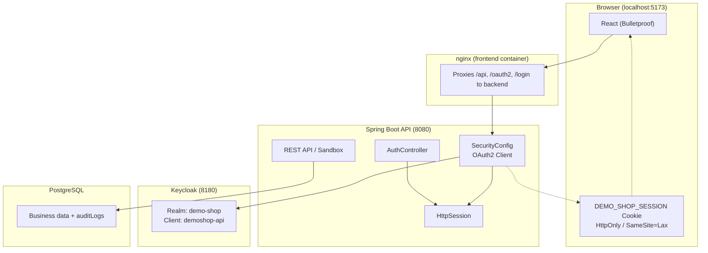
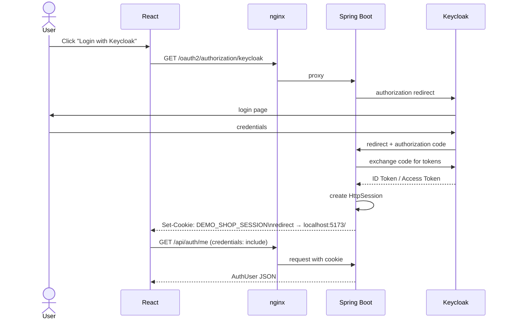
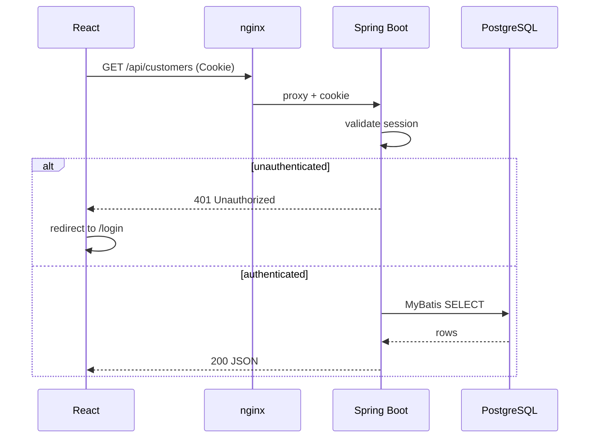
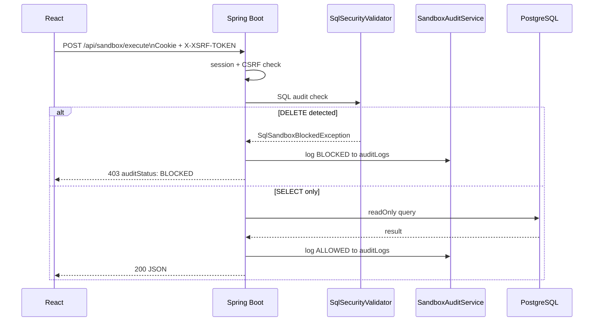
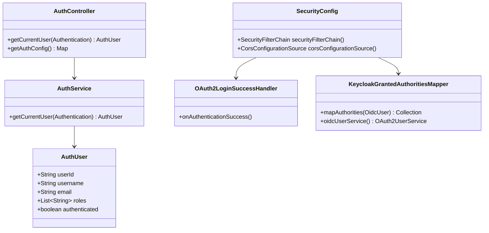

# Authentication Architecture (Keycloak + Cookie Session)

**English** | [日本語](AUTH_ARCHITECTURE.ja.md)

DemoShop uses **Keycloak (OIDC)** for login and **Spring Session cookies** for API sessions.  
The frontend does not store JWTs in localStorage; it uses `credentials: 'include'` in a BFF-style setup.

## Component Diagram



## Login Sequence (Authorization Code Flow)



## API Request Sequence



## Sandbox POST with CSRF



## Backend Class Diagram (Auth)



## Demo Keycloak Accounts

| User | Password | Roles |
|------|----------|-------|
| demo | demopass | learner |
| admin | adminpass | admin, learner |

Keycloak admin console: http://localhost:8180 (admin / admin)

## Local Dev Without Keycloak

Tests use `app.security.enabled=false` to skip authentication.

```bash
APP_SECURITY_ENABLED=false ./scripts/runBackend.sh
```
