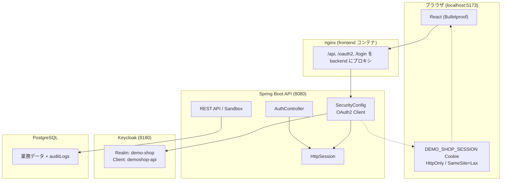
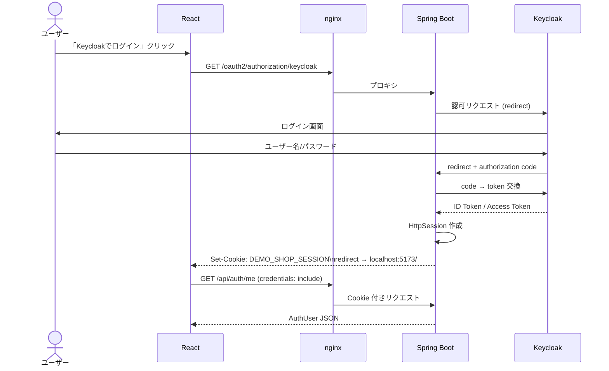
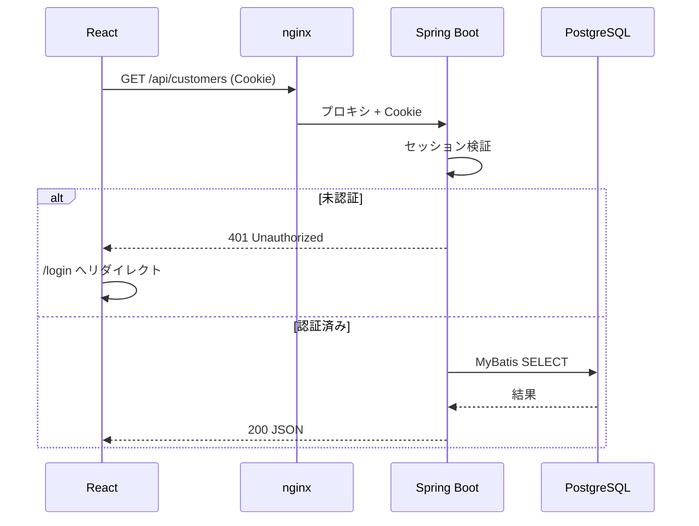
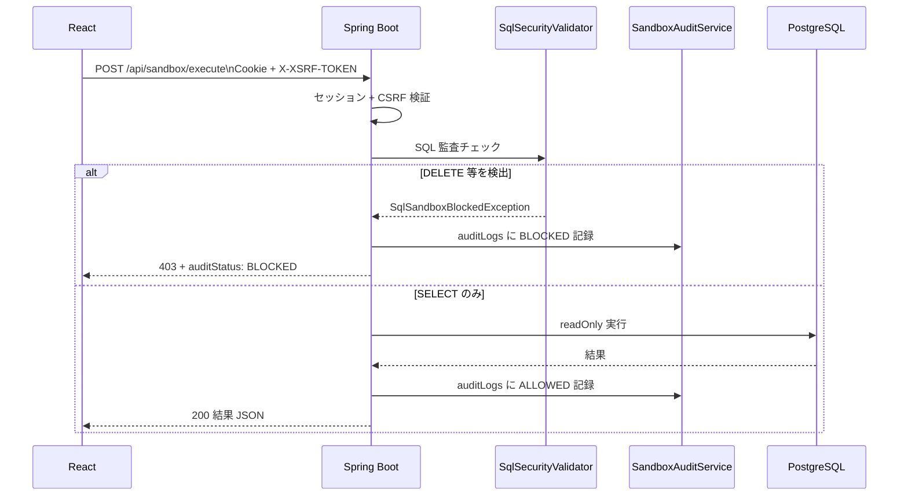
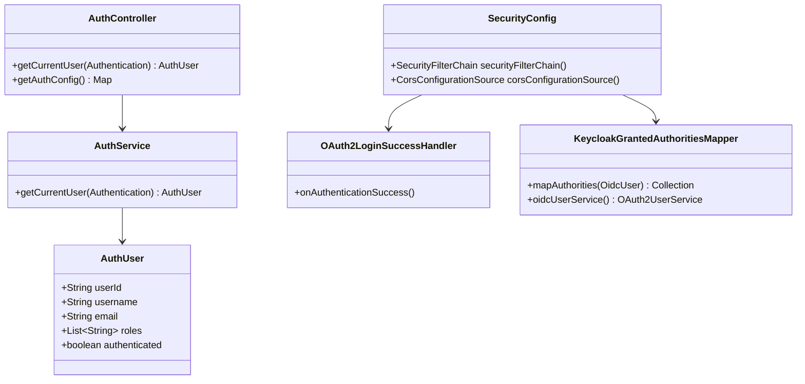
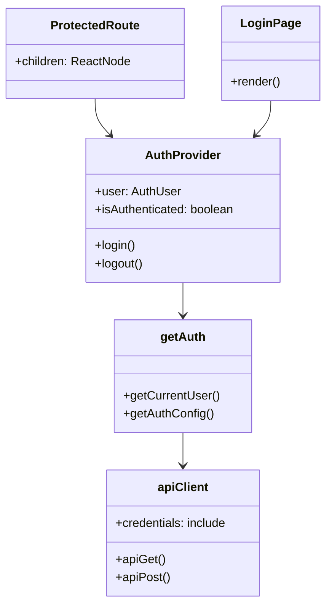

# 認証アーキテクチャ（Keycloak + Cookie セッション）

[English](AUTH_ARCHITECTURE.en.md) | **日本語**

DemoShop は **Keycloak（OIDC）** でログインし、**Spring Session Cookie** で API セッションを管理します。  
フロントエンドは JWT を localStorage に保存せず、`credentials: 'include'` で Cookie ベースの BFF 構成です。

## コンポーネント構成



## ログインシーケンス（Authorization Code Flow）



## API リクエストシーケンス



## SQL サンドボックス POST（CSRF 付き）



## バックエンド クラス図（認証関連）



## フロントエンド クラス図（認証関連）



## Cookie / セキュリティ設定

| 項目 | 値 |
|------|-----|
| セッション Cookie 名 | `DEMO_SHOP_SESSION` |
| HttpOnly | `true`（JS から不可） |
| SameSite | `Lax` |
| Secure | ローカル `false` / 本番 `true` 推奨 |
| CSRF | `CookieCsrfTokenRepository`（POST 時 `X-XSRF-TOKEN`） |

## Keycloak デモアカウント

| ユーザー | パスワード | ロール |
|---------|-----------|--------|
| demo | demopass | learner |
| admin | adminpass | admin, learner |

Keycloak 管理コンソール: http://localhost:8180 （admin / admin）

## ローカル開発（Keycloak なし）

テスト実行時は `app.security.enabled=false` で認証をスキップします。

```bash
APP_SECURITY_ENABLED=false ./scripts/runBackend.sh
```
